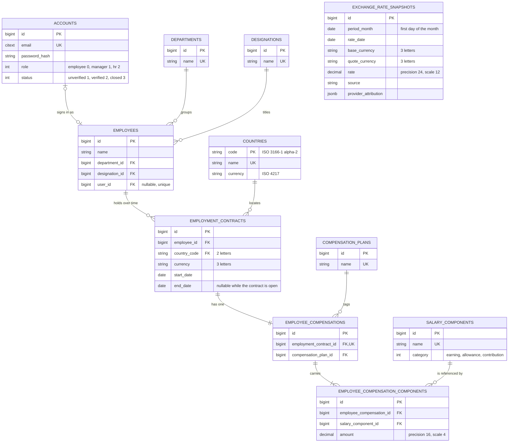

# Salary Manager

Salary Manager is a monorepo for managing employee contracts and employee-specific compensation. The backend is a Rails API; the frontend is a React application.

## Current state

- The backend provides cookie-session authentication, read endpoints for employees, reference data and compensation plans, nested employment contracts, an organization-wide dashboard overview endpoint, and a current-month exchange-rate conversion endpoint.
- Each employment contract has one `EmployeeCompensation`. Compensation plans are reusable filter tags; component amounts belong to that contract's compensation and use the contract currency.
- `EmployeeCompensation` supports nested component assignment at the model layer. There are no HTTP contract create/update endpoints.
- The frontend provides sign-in, a session-gated shell, a paginated and filterable employee table with active-contract details and total compensation, and an employee contract drill-down that can display an active employee's total in another available currency. Payroll and reporting UI remain future work.
- There is no payroll run, reporting-month selector, or stored report; the dashboard overview is a current-state aggregate, and currency conversion is a separate read operation over the stored monthly snapshots.
- A seed creates three sign-in accounts (`dev@example.com`, `manager@example.com` and `hr@example.com`, one per role). Employees and reference data come from the `sample_data` rake tasks, not the seed.

## Data model

The backend schema, as dumped in [`backend/db/schema.rb`](./backend/db/schema.rb):



An account is optional on an employee, and an employee keeps historical contracts while at most one of them is open ended. Each contract has exactly one employee compensation, which carries at least one amount-bearing component row; the plan is only a tag. `exchange_rate_snapshots` is standalone - it references currencies by code with no foreign key - and Rodauth's `account_*_keys` tables (login change, password reset, remember, verification) hang off `accounts.id` and are omitted here.

## API documentation

The [OpenAPI 3.0 source](./backend/doc/openapi.yml) defines current HTTP routes and response schemas. Browse the [rendered API documentation](https://senbinil.github.io/salary-manager/); GitHub Pages publishes it from `main` when the API spec, docs build configuration, or workflow changes, and it can also be rebuilt manually.

## Run locally

Start PostgreSQL, then run the backend from `backend/`:

```sh
bin/setup --skip-server
bin/rails db:seed    # the sign-in accounts; bin/setup does not seed
bin/dev
```

The dashboard starts empty: `bin/setup` prepares the databases but creates no employees or reference data. The `sample_data` task creates what it needs on the way in, and `clear` removes exactly the rows it wrote.

```sh
CONFIRM_SAMPLE_DATA=yes bin/rails 'sample_data:load[10000]'
CONFIRM_SAMPLE_DATA=yes bin/rails sample_data:clear
```

In another terminal, start the frontend from `frontend/`:

```sh
npm ci
npm run dev
```

Backend verification uses `cd backend && bin/ci`. Frontend checks use `cd frontend && npm run lint`, `npm run test:run`, and `npm run build`.

## Deployment

Live at [diciq.site](https://diciq.site), with the API at [api.diciq.site](https://api.diciq.site) (`GET /up` is its health check).

Both apps deploy with [Kamal](https://kamal-deploy.org) as two services on one server, sharing Kamal's proxy and the `kamal` docker network, and reading their values from a gitignored `.env.production` in each app directory:

```sh
cd backend && bin/kamal setup     # first deploy: installs the proxy and starts the API
cd frontend && bin/kamal setup    # adds the SPA route to the same proxy
```

Later releases use `bin/kamal deploy` from either directory. Postgres is the accessory another Kamal service already runs on the same host, so neither app declares an `accessories:` block. The SPA is served from its own subdomain and calls the API cross-origin, so the backend's `CORS_ORIGINS` lists the frontend origin and the frontend bakes its API origin into the bundle at build time as `VITE_API_URL`.

[Deployment](./docs/DEPLOYMENT.md) has the topology, every `.env.production` key, first-boot database creation, and the deploy health checks; [backend/README.md](./backend/README.md#deployment) and [frontend/README.md](./frontend/README.md#deployment) hold the per-app detail.

## Stack

| App | Main technologies |
| --- | --- |
| Backend | Ruby 4.0.5, Rails 8.1, PostgreSQL, Rodauth, Solid Queue, RSpec, FactoryBot, Kamal |
| Frontend | Node 24, React 19, Vite 8, React Router 8, TanStack Query, axios, MUI, Vitest, React Testing Library, Kamal + nginx |

## CI

GitHub Actions runs checks when changes touch each app:

- **Backend** (`backend.yml`): Brakeman, bundler-audit, RuboCop, and RSpec with PostgreSQL.
- **Frontend** (`frontend.yml`): ESLint, Vitest coverage, and the Vite production build.
- **API docs** (`docs.yml`): builds and publishes the OpenAPI documentation to GitHub Pages from `main` when its source or build configuration changes; it also supports a manual run.

## Repository layout

- `backend/` — Rails API, backend specs, and the OpenAPI source at `backend/doc/openapi.yml`.
- `frontend/` — React single-page application and frontend specs.
- `docs/` — current architecture and implementation documents, decision records, and archived documentation.

## Documentation

- [Architecture v0.7](./docs/ARCHITECTURE.md) — current model and behavior.
- [Implementation plan](./docs/IMPLEMENTATION-PLAN.md) — delivered model/API work, dashboard slices, dashboard filters, overview aggregates, and employee drill-down.
- [Salary component relationships](./docs/SALARY-COMPONENT-RELATIONSHIPS.md) — plan tags, shared component definitions, and employee-specific amounts.
- [Deployment](./docs/DEPLOYMENT.md) — deployed topology, Kamal configuration, and the `.env.production` keys.
- [ADR-0001](./docs/decisions/ADR-0001-employee-specific-compensation.md) — rationale and alternatives for the compensation model.
- [ADR-0002](./docs/decisions/ADR-0002-employee-dashboard-and-totals.md) — dashboard, drill-down, and total compensation decisions.
- [ADR-0003](./docs/decisions/ADR-0003-monthly-fx-snapshots-and-conversion.md) — monthly FX snapshots, the provider importer, and the conversion API.
- [Documentation index and version history](./docs/README.md).
- [Backend guidance](./backend/AGENTS.md) and [frontend guidance](./frontend/AGENTS.md).
