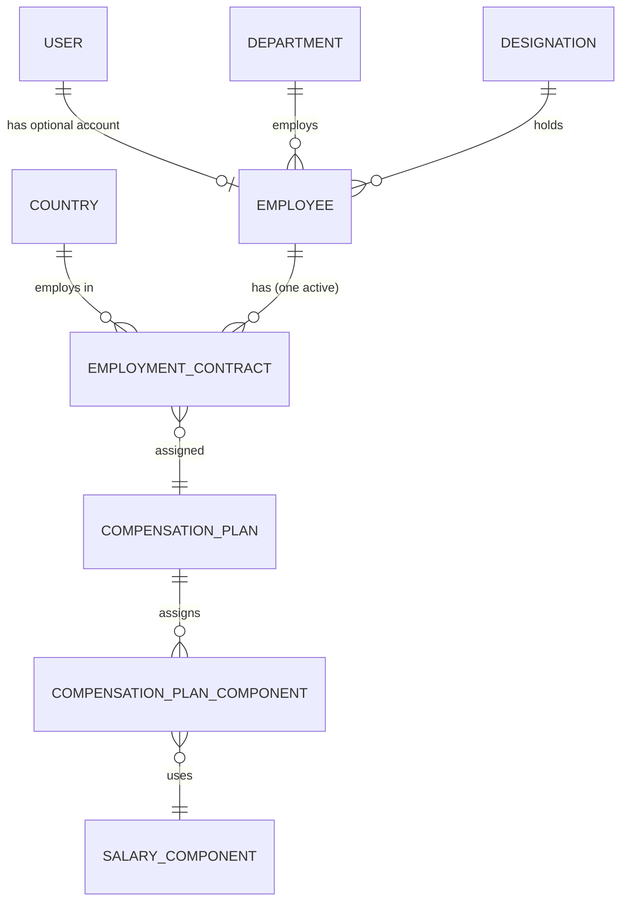

# Payroll Design v0.5

This document supersedes the v0.4 design, whose full text is preserved at [`archive/ARCHITECTURE-v0.4.md`](./archive/ARCHITECTURE-v0.4.md). **v0.5 retires the payroll-run and deduction model.** There is no payroll run, no persisted payroll result, and no deductions — compensation is defined on the contract and reported directly. The v0.1–v0.3 lineage is recorded in [`archive/ARCHITECTURE-HISTORY.md`](./archive/ARCHITECTURE-HISTORY.md).

---

## 1. Design Principles & Explicit Assumptions

1. **The Employment Contract is the source of truth** for how an employee is compensated.
2. **One active employment contract per employee** — enforced by `end_date` + a partial unique index.
3. **One contract currency.** All compensation amounts are expressed in it, and component amounts carry no currency of their own.
4. **FX belongs to reporting only** — never to setup.
5. **Salary components are reusable across countries** (shared vocabulary).
6. **Compensation amounts are monthly.** No `pay_frequency` column exists — one value would only restate this principle.
7. **Nothing is frozen.** There is no payroll run and no persisted payroll result; reporting is a live projection over current contracts and plans (§6).
8. **Money is stored at a fixed scale** — `decimal(16,4)` — and displayed rounded to the currency's ISO 4217 minor unit.

---

## 2. Domain Overview

```
User
 |
Employee
 |
Employment Contract   (one contract currency)
 |
Compensation Plan
 |
Compensation Components
 |
Reporting Dashboard
```

`Compensation Components` is **two** entities working together (§5.6, §5.7): a reusable `SalaryComponent` definition, plus a `CompensationPlanComponent` assignment that gives it an amount. That split is deliberate and is explained in [`SALARY-COMPONENT-RELATIONSHIPS.md`](./SALARY-COMPONENT-RELATIONSHIPS.md).

There is **no execution step**. Nothing sits between setup and reporting — the dashboard reads setup directly (§6).

---

## 3. Currency Rule

- `EmploymentContract.currency` is the **single currency** for the employee's compensation.
- It **defaults to** the employment `country`'s currency and **may be overridden** (e.g. an expat in India paid in USD has `currency = USD`; the contract country remains India for reporting).
- `CompensationPlanComponent.amount` is **always expressed in the contract currency** — no per-component currency field exists.
- Consequence: an employee's compensation is always expressed in one currency, so the "foreign-currency salary" case is satisfied by a contract-currency override, not by per-component FX.

---

## 4. Relationships



Textual summary:

- **User → Employee** (optional, one-to-one)
- **Department → Employee** (one-to-many; every employee belongs to exactly one department)
- **Designation → Employee** (one-to-many; every employee holds exactly one designation)
- **Country → Employment Contract** (one-to-many)
- **Employee → Employment Contract** (one-to-many over time; **one active**)
- **Employment Contract → Compensation Plan** (many-to-one)
- **Compensation Plan → Compensation Plan Component** (one-to-many)
- **Compensation Plan Component → Salary Component** (many-to-one)

Every edge above is a persisted foreign key. Exchange rates are **not** part of the domain model — they are reporting input, not a relationship between domain entities (§8).

---

## 5. Entity Definitions

### 5.1 User

```
User
----
id            bigint PK
name          string
email         string (unique)
role          enum: hr | manager | employee
```

An employee **may** have a user account (a user is not necessarily an employee).

### 5.2 Employee

```
Employee
--------
id            bigint PK
user_id       bigint FK → users, nullable, unique
name          string
department_id bigint FK → departments, not null
designation_id bigint FK → designations, not null
```

> `country` is deliberately absent. Employment country lives on the active `EmploymentContract`; an employee's location is derived from it. Termination is represented by setting the contract's `end_date`.

An employee may have multiple `EmploymentContract` records over time; each contract belongs to one employee. The contract date ranges must not overlap (§7).

### 5.3 Employment Contract (source of truth)

```
EmploymentContract
------------------
id                    bigint PK
employee_id           bigint FK → employees, not null
country_code          string FK → countries, not null
currency              char(3), not null       # defaults to country.currency, overridable
compensation_plan_id  bigint FK → compensation_plans, not null
start_date            date, not null
end_date              date, nullable           # null = open-ended
```

Constraints:

- `CHECK (end_date IS NULL OR end_date > start_date)` — a contract cannot start and end on the same day.
- Partial unique index: `UNIQUE (employee_id) WHERE end_date IS NULL` — at most one open-ended contract per employee.
- Application-level check: contract date ranges for an employee must not overlap.

### 5.4 Country (reference data)

```
Country
-------
code         char(2) PK  # ISO 3166-1 alpha-2
name         string
currency     char(3)     # ISO 4217
```

> The countries in this table also drive FX: a normalized report's pairs are the distinct currencies in it × the configured reporting currencies (§8), so which countries exist here sets FX volume.

### 5.5 Compensation Plan

```
CompensationPlan
----------------
id            bigint PK
name          string
```

Contains one or more `CompensationPlanComponent`s.

### 5.6 Compensation Plan Component (assignment)

```
CompensationPlanComponent
-------------------------
id                    bigint PK
compensation_plan_id  bigint FK → compensation_plans
salary_component_id   bigint FK → salary_components
amount                decimal(16,4)   # in contract currency
```

> No `currency` field — the amount is always in the owning contract's currency (§3).

> No `frequency` field either — compensation amounts are monthly system-wide (principle 6), so a one-value column would only restate an assumption the system already makes.

> **Edited in place.** Amounts are not effective-dated, so changing an amount changes what past reports show (§6.5).

### 5.7 Salary Component (shared vocabulary)

```
SalaryComponent
---------------
id            bigint PK
name          string
category      enum: earning | allowance | contribution
```

- `earning` and `allowance` are the categories that count toward an employee's reported compensation (§6.2).
- `contribution` (e.g. employer-side PF) is **not** part of it, and remains deferred (§9).

A `SalaryComponent` stores **no amount of its own** — it is vocabulary, and the amount lives on the assignment that uses it (§5.6).

### 5.8 Exchange Rate Snapshot (rate store)

```
ExchangeRateSnapshot
--------------------
id              bigint PK
period_month    date       # first day of the month these rates serve
from_currency   char(3)
to_currency     char(3)
rate            decimal(16,10)
rate_date       date       # as-of date of the rate
source          string     # e.g. "ECB", "openexchangerates", "manual"
```

A stored rate is attributable: `rate_date` and `source` record when it was true and where it came from. A conversion uses only a stored snapshot; a pair without one shows no figure (§8).

> **Owned by the month, not a run.** `(period_month, from_currency, to_currency)` is unique. In v0.4 this table hung off `payroll_run_id`; with runs retired the month is the owner — rates are written on the first dashboard load of the month and reused for the rest of it (§8).

### 5.9 Department

```
Department
----------
id            bigint PK
name          string
```

Every employee belongs to a department (`Employee.department_id`, §5.2) — required, so an employee always has a department for filtering. Department is a lookup used for organization and report filters; it does not affect compensation amounts.

### 5.10 Designation

```
Designation
-----------
id            bigint PK
name          string
```

A **designation** (a.k.a. job title) is a lookup table, referenced by the required `Employee.designation_id` (§5.2). Keeping it a relation rather than free text makes it stable and filterable: reports group and filter by `Designation.name` without typos or duplicates. Designation does not affect compensation amounts.

---

## 6. Reporting

### 6.1 Scope

Period-based employee selection is **not defined for v0.5**. The period-overlap rule is out of scope and may be reconsidered during future reporting work (§9). Phase 6 needs design review before implementation; no replacement selection rule is chosen here.

Once report scope is defined, reported amounts come from the selected contract's compensation plan:

```
EmploymentContract.compensation_plan_id
  → CompensationPlan
    → CompensationPlanComponent  (amount)
      → SalaryComponent          (category)
```

### 6.2 The reported figure

An employee's reported figure is their **total compensation**: the sum of the amounts of their assigned components whose category counts toward pay (`earning`, `allowance`).

There is no gross/net distinction, and **no payable or net figure exists** — total compensation is the only reported figure. `contribution` components are excluded because they are not compensation (§5.7). If a payable concept is ever required, it is expressed as a `SalaryComponent.category`, not as a computed net.

### 6.3 Native view

Group by contract currency and sum. No FX is involved.

### 6.4 Normalized view

A user selects a reporting currency. Each contract-currency total is converted at full precision, **rounded to the reporting currency's ISO 4217 exponent**, and then summed (§8). Rates are captured once per month, so every load within a month produces identical normalized figures. A currency whose pair is missing shows no figure, and the total is flagged rather than under-counted (§8).

### 6.5 Nothing is frozen — by design

Reporting is a **read-only projection**. There is no payroll run, no persisted result, and no snapshot of reported figures — deliberately.

- A report is computed **on read**, from the current contracts and plan components.
- **Nothing is effective-dated.** Editing a plan amount or a contract changes past reports: there is no historical version of either to read instead, and no frozen figure to fall back on. The only input that does not drift is FX, which is fixed once captured for a month (§8).
- A change is therefore either a **factual correction** — fixing a wrong contract or a mistyped rate — or a **genuine retroactive edit**. The model cannot tell the two apart.

The design keeps **no audit trail and no effective-dating**: v0.5 cannot prove what a report said on a past date. That is accepted, not overlooked.

---

## 7. Active Contract Resolution

- A contract is **active on date D** iff `start_date <= D` and (`end_date IS NULL` or `D <= end_date`).
- **One active contract per employee** is enforced by the partial unique index (`UNIQUE (employee_id) WHERE end_date IS NULL`) plus an application-level non-overlap check on date ranges.
- Period-overlap report scoping is out of scope for v0.5 and may be reconsidered in future reporting design (§9). No period-based contract selection rule is defined here.
- Termination = setting the contract `end_date`. Proration for mid-period hire/termination is deferred (§9).

---

## 8. FX Handling

FX is **outside** setup entirely.

- **Setup:** one currency per contract; component amounts carry no currency (§3).
- **Reporting:** `contract-currency totals → FX conversion → normalized report`.

Rules:

- **Pair set:** every **distinct currency in the `Country` table** × every **configured reporting currency**, excluding identity pairs (`C → C` is 1.0 and needs no row). The set is fixed and known in advance — it does not depend on which employees are in scope.
- **Reporting currencies are a configured list**, not something derived from compensation data. The set is system configuration, not a property of any country or contract.
- **Capture point:** rates are fetched **once per calendar month, on the first dashboard load of that month**, and stored per pair keyed to the month (§5.8). Every later load in that month reuses them, so a month's normalized report is identical for every user and every page load.
- **Rounding:** a converted amount is rounded to the reporting currency's ISO 4217 exponent before the totals are summed — the exponent is reporting configuration, not a `Country` attribute (§5.4).
- **No live fallback.** A conversion uses **only** a stored snapshot for `(period_month, pair)`. A missing pair shows **no figure** in the normalized view, flagged _rate unavailable_; the report total is shown with a flag `N currencies unavailable`. There is no estimated branch and no fabricated rate.
- A reporting currency registered mid-month starts being captured at the **next** load; until then it shows no normalized figure.

---

## 9. Deferred Items

Deliberately out of scope, by decision — not open questions:

- Payment processing
- Country-specific tax engines
- `contribution` category components (employer-side)
- Pay frequencies other than `monthly`
- Proration for mid-period hire/termination
- Mid-period plan switches — for now a contract's `compensation_plan_id` is treated as stable; no rule defines a switch's effect on past periods.
- Period-overlap report scoping — selecting contracts whose date ranges intersect a reporting period is out of scope for v0.5. It may be reconsidered during future reporting design; Phase 6 requires review before implementation.

> Payroll approvals are **not** listed: they governed a payroll run's status workflow, and runs are retired (§2).
