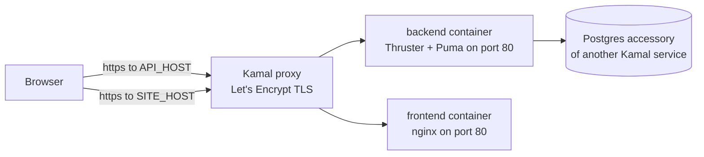

# Deployment

Both applications deploy with [Kamal](https://kamal-deploy.org) from their own directory, as two services on one server. This document describes the deployed topology and how each service gets its configuration. Per-app detail stays in [`backend/README.md`](../backend/README.md#deployment) and [`frontend/README.md`](../frontend/README.md#deployment).

## Topology



| Service | Directory | Image | Public host | Health check |
| --- | --- | --- | --- | --- |
| Backend | `backend/` | `<DOCKERHUB_USER>/salary-manager-backend` | `API_HOST` | `GET /up` |
| Frontend | `frontend/` | `<DOCKERHUB_USER>/salary-manager-frontend` | `SITE_HOST` | `GET /` |

Both services run on `DEPLOY_HOST` and share Kamal's proxy and the `kamal` docker network. Each `config/deploy.yml` declares its own proxy route, so whichever app is set up first installs the proxy and the second adds a route to it. The proxy terminates TLS with a Let's Encrypt certificate for each host; both containers listen on plain HTTP port 80 internally (`app_port` is left unset because that is the default).

The browser loads the SPA from `SITE_HOST` and calls the API on `API_HOST`; a subdomain is a different origin, which is why the backend needs `CORS_ORIGINS` and the frontend needs `VITE_API_URL`.

Postgres is **not** an accessory of either app. It is the accessory another Kamal service already runs on the same host, so neither `config/deploy.yml` defines an `accessories:` block — doing so would start a second Postgres and a conflicting volume. The backend container reaches it by container name over the shared network (`DB_HOST`), never through `127.0.0.1`.

## How the configuration is supplied

Kamal 2 reads only `.kamal/secrets-common` and `.kamal/secrets` — it has no `.env` support of its own. Each app's `bin/kamal` is a wrapper that loads `.env` and `.env.<KAMAL_DESTINATION, production>` with dotenv before handing over to Kamal:

- `.env.production` is the only file to maintain per deployment. It is gitignored and excluded from the image by `.dockerignore`.
- `.kamal/secrets` is tracked, so it holds no literals: it maps secret names to variables from `.env.production`, and the backend additionally reads `RAILS_MASTER_KEY` from `backend/config/master.key`.
- `config/deploy.yml` interpolates every host, registry and image value with `<%= ENV.fetch("...") %>`, so no environment-specific value is committed. Add a key to `.env.production` rather than hardcoding it in the YAML.
- Real environment variables win over the files, so `DEPLOY_HOST=1.2.3.4 bin/kamal deploy` overrides what is on disk.

Never commit a value from either `.env.production`, and never inline one into a tracked file.

### Backend values (`backend/.env.production`)

| Key | Purpose |
| --- | --- |
| `DOCKERHUB_USER` | Docker Hub user; also the image namespace. |
| `DEPLOY_HOST` | The server both services deploy to. |
| `API_HOST` | Public API host; the proxy requests its TLS certificate. |
| `FRONTEND_ORIGIN` | Frontend origin, fed into the container as `CORS_ORIGINS`. Full URL only. |
| `DB_HOST` | Container name of the shared Postgres accessory. |
| `DB_USER` | Role owning `backend_production` and its siblings. |
| `KAMAL_REGISTRY_PASSWORD` | Docker Hub access token; mapped by name in `.kamal/secrets`. |
| `BACKEND_DATABASE_PASSWORD` | Password of the `backend` role; mapped by name in `.kamal/secrets`. |
| `KAMAL_SSH_KEY` | Private key Kamal connects with; defaults to `~/.ssh/id_rsa`. |

### Frontend values (`frontend/.env.production`)

| Key | Purpose |
| --- | --- |
| `DOCKERHUB_USER` | Docker Hub user; also the image namespace. |
| `DEPLOY_HOST` | The same server the API deploys to. |
| `SITE_HOST` | Public host for the SPA; the proxy requests its TLS certificate. |
| `API_URL` | Public API origin, no trailing slash and no `/api/v1`; baked into the bundle as `VITE_API_URL`. |
| `KAMAL_REGISTRY_PASSWORD` | Docker Hub access token; mapped by name in `.kamal/secrets`. |
| `KAMAL_SSH_KEY` | Private key Kamal connects with; defaults to `~/.ssh/id_rsa`. |

### Secrets and the master key

- `backend/config/credentials.yml.enc` is committed; `backend/config/master.key` is gitignored and excluded from the image, and only `.kamal/secrets` reads it.
- `KAMAL_SSH_KEY` takes a different route from the other secrets: the `ssh:` block in each `config/deploy.yml` passes it to net-ssh as the private key, so it is never injected into a container.
- CI is separate: the backend workflow uses the `RAILS_MASTER_KEY` repository secret, and the deploy files play no part in it.

## Databases

Production uses four databases on the shared Postgres: `backend_production` plus its `_cache`, `_queue` and `_cable` siblings. The container entrypoint runs `db:prepare` on boot, which migrates the primary database and creates the other three on first boot — that creation needs the `backend` role to hold `CREATEDB`; otherwise create all four by hand before the first deploy.

Production deliberately does not set `DATABASE_URL`, because that variable only overrides the primary configuration.

## Build-time versus runtime configuration

| Value | Where it lives | Changing it needs |
| --- | --- | --- |
| `SOLID_QUEUE_IN_PUMA`, `DB_HOST`, `DB_USER`, `CORS_ORIGINS` | `clear` env in `backend/config/deploy.yml` | A redeploy (`CORS_ORIGINS` is read at boot). |
| `RAILS_MASTER_KEY`, `BACKEND_DATABASE_PASSWORD` | `secret` env in `backend/config/deploy.yml` | A redeploy, plus updating the credentials or role password. |
| `VITE_API_URL` | `builder.args` in `frontend/config/deploy.yml` | A **new image**: Vite inlines the origin at build time. |

The frontend image carries no runtime configuration and declares no `env` block. `nginx.conf` serves the built SPA with a fallback so client routes answer 200, `no-cache` on `index.html`, and immutable caching for the hashed `/assets/*`.

## Deploying

From `backend/`:

```sh
bin/kamal setup         # first deploy: proxy, certificate, image, container
bin/kamal deploy        # later releases
bin/kamal app logs -f   # expect "Started Supervisor" from SOLID_QUEUE_IN_PUMA
bin/kamal console       # create the first account
bin/kamal dbc           # database console
```

From `frontend/`:

```sh
bin/kamal setup
bin/kamal deploy
bin/kamal logs -f
bin/kamal shell
```

The entrypoint runs `db:prepare` but never `db:seed`, so a fresh production instance has no accounts until one is created in the console (or the idempotent account seed is run by hand — it warns before writing in production).

Kamal's health check must pass before the old container is stopped, so a failing check rolls the deploy back:

- Backend: `GET https://<API_HOST>/up` answers 200. `production.rb` excludes `/up` from the SSL redirect, or the proxy's plain-HTTP check would receive a 301.
- Frontend: `GET https://<SITE_HOST>/` answers 200; `https://<SITE_HOST>/dashboard` must too, which the nginx SPA fallback provides.

## Local development versus production

In development the Vite dev server proxies `/api` to `http://localhost:3000`, so requests are same-origin: no CORS check runs and the session cookie rides along as `SameSite=Lax`. In production the SPA and the API are separate origins, so the backend needs `CORS_ORIGINS` to list the frontend origin and the frontend needs `VITE_API_URL` plus `withCredentials` on its axios client. Both stay inside one site, so `SameSite=Lax` is still sufficient; a genuinely cross-site deployment would additionally need `same_site: :none, secure: true` over HTTPS.
