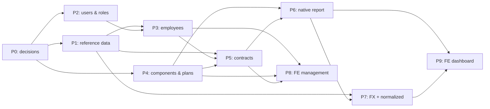

# Implementation Plan — Payroll v0.5

This turns [`ARCHITECTURE.md`](./ARCHITECTURE.md) into an ordered set of build phases. It is a plan, not a spec: each phase below states its goal, the schema/logic it adds, the endpoints it exposes, and its definition of done. Entity definitions and rules live in `ARCHITECTURE.md`; this document only sequences the work and names the decisions to make along the way.

---

## How to use this plan

- **One slice at a time.** A phase is delivered as one or more thin slices. Each slice follows the repo's TDD shape: the spec commit lands first ("Red on purpose"), then the implementation commit, with Conventional Commits. Confirm each slice's test seams (route-level + shell-level integration) before writing its specs.
- **Backend first, frontend after.** Phases 1–7 build the API and domain; Phases 8–9 build the UI on top of it. A frontend screen can be pulled earlier and paired with its backend phase if the user prefers vertical slices — the dependency graph below marks what each screen needs.
- **Respect the deferred list.** `ARCHITECTURE.md` §9 is authoritative: no payment processing, no tax engines, no `contribution` amounts in reporting, no non-monthly frequencies, no proration, no mid-period plan switches. A phase that drifts into one of those is out of scope.

---

## Conventions the phases assume

| Concern | Convention |
| --- | --- |
| API prefix | `/api/v1`, application routes via `namespace :api { namespace :v1 { ... } }` in `config/routes.rb` (auth stays on Rodauth, which bypasses the router) |
| Controllers | `Api::V1::*Controller`, inheriting from `ApplicationController` (which already owns `current_account` + `authenticate!`) |
| Tests | RSpec request specs (`spec/requests/`) for endpoints, model specs for constraints/validations, FactoryBot factories; run `bundle exec rspec` |
| Money | plain `decimal(16,4)` columns — no money gem; rounding happens only at report/display time (§8) |
| Frontend | data-mode routes in `src/router/routes.js` with paths in `src/router/paths.js`, TanStack Query v5 + axios, MUI v9, Vitest + RTL (`npm run test:run`) |

---

## Phase dependency graph

---

## Phase 0 — Decisions before any code

Nothing is built here. Settle these five points first; each later phase names which decision it depends on. A settled point says so and records the choice.

### D0.1 — Where the profile and role live — **settled**

Rodauth's `accounts` table stays the only identity table, and `Employee.user_id` points at it. So the design's `User` is the account, with two deliberate calls:

- **`role` goes on `accounts`.** Access control belongs to the account, not the employee: a user is not necessarily an employee, so a role has to exist for accounts with no employee record. It is also the safer home — accounts have no CRUD endpoint, whereas HR will edit employees in Phase 8, so a role on that table would be a privilege-escalation path.
- **`name` does *not* go on `accounts`.** `Employee.name` (§5.2) already holds it, so a second column would duplicate it. A non-employee account displays as its email until something needs more.

Roles are numbered least-privileged first — `employee: 0, manager: 1, hr: 2` — and the column default is `0`, because that default is what Rodauth's own insert applies and what the public `create-account` route hands out.

### D0.2 — Country data source — **settled**

Do not ship country seed data. Phase 1 provides the `Country` table and read endpoint, while endpoint specs create the rows they need with FactoryBot. This keeps the test data explicit and avoids making seeded reference data a prerequisite for exercising the endpoint. The table stores only `code`, `name`, and `currency`; the ISO 4217 exponent is part of reporting-currency configuration (§8), not a country attribute.

### D0.3 — Reporting-currency configuration

§8 makes reporting currencies a **configured list**, not derived from data. Decide the store: a small DB table (recommended — runtime config, changed by an admin, no redeploy) vs. an env var/credentials list (deploy-time only). Phase 7 reads this.

### D0.4 — FX provider

Phase 7 introduces an adapter behind a fixed interface (`from`, `to` → `{ rate, rate_date, source }`). Decide now whether the first provider is ECB, openexchangerates, or manual entry — the adapter signature is identical; only the implementation differs. Manual is a valid v1 and satisfies "no live fallback, no fabricated rate" by construction.

### D0.5 — Component-assignment uniqueness — **settled**

A compensation plan may assign each `SalaryComponent` only once: enforce `UNIQUE (compensation_plan_id, salary_component_id)`. The plan-component row stores one amount for that component in the plan, so repeated assignments would be ambiguous; separate bonus concepts should be separate salary components. Phase 4 implements this in both the database and model validation.

---

## Phase 1 — Reference data: `Country`, `Department`, `Designation`

**Goal.** Land the three lookup tables that everything else keys off, and their read endpoints.

- Migrations:
  - `countries`: `code char(2) PK`, `name`, `currency char(3)`.
  - `departments`: `id`, `name`.
  - `designations`: `id`, `name`.
- Populating `countries` is deferred to **D0.2** — this phase ships the table empty, and the read endpoints return whatever it holds.
- Models + FactoryBot factories + model specs (presence/uniqueness as applicable).
- Endpoints (read-only for now; management CRUD is Phase 8): `GET /api/v1/countries`, `GET /api/v1/departments`, `GET /api/v1/designations`.
- **Done when:** the three tables exist, the three endpoints return their lists, and specs are green — the endpoint specs build their rows with factories, so nothing depends on seed data.

---

## Phase 2 — Users & roles (extends `accounts`)

**Goal.** Give the account a role and add role-based authorization. No `name` column — `Employee.name` owns the display name (D0.1).

- Migration: add `role` (`integer`, `not null`, `default: 0`) to `accounts`.
- `Account` model: `enum :role, { employee: 0, manager: 1, hr: 2 }, default: :employee` — numbered least-privileged first, using the enum's own `default:` option. Keep the `status` enum untouched, and see its comment about not re-declaring an attribute.
- Extend `GET /api/v1/me` to return `{ id, email, role }`; its "no extra keys" example changes to the new shape.
- Add `require_role!(*roles)` to `ApplicationController`, mirroring the `authenticate!` style: signed out still answers 401, a signed-in account whose role is not allowed gets 403 `insufficient_role`.
- **Done when:** the migration is applied, `me` returns the role, `require_role!` blocks and allows correctly, specs green.

> `require_role!` has no production caller until Phase 8 gates the management screens, so it is exercised through a controller spec with an anonymous controller. Inviting accounts (passwordless) is **deferred**: it works — `password_hash` is nullable and `reset-password-request` accepts such an account — but only the role is in scope here.

---

## Phase 3 — Employees

**Goal.** Model the employee and its required `Department`/`Designation` links.

- Migration:
  - `employees`: `id`, `user_id` (nullable, unique FK → `accounts`), `name`, `department_id` (not null FK), `designation_id` (not null FK).
- `Employee` model: belongs_to associations, validations (`department_id`/`designation_id` presence), `user` unique.
- Endpoints (read-only for now, like Phase 1; management CRUD is Phase 8): `GET /api/v1/employees` and `GET /api/v1/employees/:id`. `create`/`update` are deferred to Phase 8, and termination is an `end_date`, not a delete.
- **Done when:** the table and model exist, validations are specified, both read endpoints return their lists, and specs are green. (Phases 1 and 2 must precede.)

---

## Phase 4 — Salary vocabulary & plans

**Goal.** Land the split vocabulary/assignment model: `SalaryComponent`, `CompensationPlan`, `CompensationPlanComponent`.

- Migrations:
  - `salary_components`: `id`, `name`, `category enum: earning | allowance | contribution`.
  - `compensation_plans`: `id`, `name`.
  - `compensation_plan_components`: `id`, `compensation_plan_id` FK, `salary_component_id` FK, `amount decimal(16,4)`. No `frequency` — amounts are monthly system-wide, so the column would only restate that. Apply the **D0.5** uniqueness choice.
- Models: `SalaryComponent`, `CompensationPlan` (`has_many :compensation_plan_components`), `CompensationPlanComponent` (amount presence/non-negative; **no currency column** — §3).
- Endpoints (read-only for now, like Phase 1; management CRUD is Phase 8): `GET /api/v1/salary_components` and `GET /api/v1/compensation_plans`. A plan's `show` (embedding its components) and the nested assignment path (e.g. `POST /api/v1/compensation_plans/:id/compensation_plan_components`) are deferred to later slices.
- No starter vocabulary is seeded — `db/seeds.rb` stays a stub, so specs and demos build their rows with factories.
- **Done when:** the three tables exist with their constraints enforced, the read endpoints return their lists, and specs are green.

---

## Phase 5 — Employment Contracts & active-contract resolution

**Goal.** Land the source of truth and the rule that picks *the* active contract.

- Migration:
  - `employment_contracts`: `id`, `employee_id` FK (not null), `country_code` FK (not null), `currency char(3)` (not null), `compensation_plan_id` FK (not null), `start_date` (not null), `end_date` (nullable). No `pay_frequency` — amounts are monthly system-wide (principle 6), so the column would only restate that.
  - `CHECK (end_date IS NULL OR end_date > start_date)`.
  - Partial unique index `UNIQUE (employee_id) WHERE end_date IS NULL` (one open-ended contract per employee).
- Models: `Employee.has_many :employment_contracts`; `EmploymentContract.belongs_to :employee, :country, :compensation_plan`; default `currency` from `country.currency` on create (§3); application-level non-overlap validation.
- Active-contract resolution, split by which question is being asked:
  - `EmploymentContract.active(date = Date.current)` — §7's **point rule**: the date falls between `start_date` and `end_date`, both ends included, null `end_date` open-ended. This is the dashboard's question, so it defaults to today.
  - §7's **period rule** — a contract is in scope when its date range intersects the reporting period — moves to **Phase 6**, with the report that needs it. Proration is out of scope, so any overlap includes the employee for the report; a point test cannot answer this range question.
  - No `ActiveContract` PORO: there is no caller for one until Phase 6.
- Endpoints (read-only for now, like Phases 1, 3, and 4; management CRUD is Phase 8): `GET /api/v1/employees/:employee_id/employment_contracts` and `GET /api/v1/employees/:employee_id/employment_contracts/:id`. Both actions are nested and scoped to the employee. Writes are deferred with the rest of the CRUD, so termination (setting `end_date`) arrives with them.
- **Done when:** the partial unique index + CHECK hold, non-overlap is validated, `active` answers the point rule, the read endpoint returns its list, and specs are green.

---

## Phase 6 — Native reporting (backend)

**Goal.** The first report: live projection, no FX.

- Period predicate first: a scope implementing §7's third bullet — a contract covers a period when the two ranges intersect. Phase 5 deferred this here, because only the report needs it.
- Report service (PORO, e.g. `CompensationReport`): for a period, select in-scope employees via the §6.1/§7 rules, sum `earning` + `allowance` `CompensationPlanComponent` amounts per contract, group by contract currency.
- No gross/net, no payable, no `contribution` (§6.2) — the only figure is total compensation per currency.
- Endpoint: `GET /api/v1/reports` with a period parameter; returns the native view (§6.3). Shape is a slice decision (grouped by currency, with employee-level detail for drill-down).
- **Done when:** the native report is correct for seeded fixtures (including an employee with a `contribution` component that must be excluded), specs green. No FX anywhere.

---

## Phase 7 — FX & normalized reporting

**Goal.** Rate snapshots + the normalized view, exactly per §8.

- Migration:
  - `exchange_rate_snapshots`: `id`, `period_month` (first day of month), `from_currency`, `to_currency`, `rate decimal(16,10)`, `rate_date`, `source`. Unique `(period_month, from_currency, to_currency)`.
- Reporting-currency config per **D0.3**.
- **Decide the ISO 4217 exponent source** used to round the normalized report — it is no longer a `Country` attribute (§5.4), so this phase must state where the exponent comes from.
- Rate capture service: on the first dashboard load of a month, compute the pair set (distinct `Country` currencies × configured reporting currencies, minus identity pairs) and fill missing pairs via the **D0.4** adapter. Reuse for the rest of the month; no live fallback.
- Normalized report: convert each contract-currency total at full precision, round to the target currency's ISO 4217 exponent, then sum; a missing pair shows **no figure** and the total carries a flag (`N currencies unavailable`) — never an estimate.
- Endpoint: `GET /api/v1/reports?currency=USD` (normalized), alongside the Phase 6 native shape.
- **Done when:** first-load capture fills the month's pairs once, repeated loads reuse them, a missing pair flags instead of fabricating, rounding matches ISO 4217, specs green.

---

## Phase 8 — Frontend: management screens

**Goal.** The screens HR needs to maintain reference data and records, wired to Phases 1–5.

- New paths in `src/router/paths.js`, route entries in `src/router/routes.js` under `RootLayout` (so the shell + auth gate already apply), each gated by role where the backend enforces one.
- Screens, one slice each: departments & designations, countries (read-only), employees, salary components, plans (+ component assignment), contracts. Reuse the existing MUI theme, `lucide-react` icons, and the `errorMessage()` convention from `src/api/errorMessage.js`.
- **Done when:** each screen renders real API data through TanStack Query, mutations round-trip, and the jsdom specs pass (`npm run test:run`).

---

## Phase 9 — Frontend: reporting dashboard

**Goal.** The dashboard that consumes Phases 6–7.

- A reporting page with the native view (grouped by currency) and a normalized toggle with a reporting-currency selector, rendering the missing-pair flag from Phase 7.
- Read-only: no run, no freeze, no audit trail — reflect that the numbers are live projections (§6.5).
- **Done when:** the dashboard reflects backend fixtures, currency selection drives the normalized view, flag states render, specs green.

---

## Definition of done (every phase)

- Migrations reversible and committed; `db/schema.rb` updated.
- Models carry the design's constraints as validations/DB constraints, each specified.
- Endpoints are under `/api/v1`, covered by request specs (auth + happy + failure paths).
- No Phase pulls in anything from `ARCHITECTURE.md` §9.

---

## Out of scope (do not build)

`ARCHITECTURE.md` §9, restated so no phase reintroduces it: payment processing, country-specific tax engines, `contribution` amounts in reporting, non-monthly pay frequencies, mid-period hire/termination proration, and mid-period plan switches. There is no payroll run and no persisted result — reporting is recomputed on read, with no audit trail and no effective-dating.
