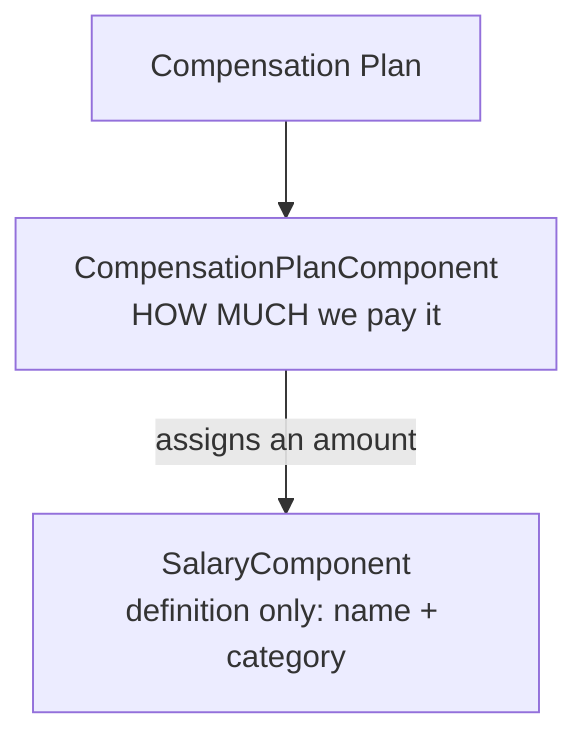
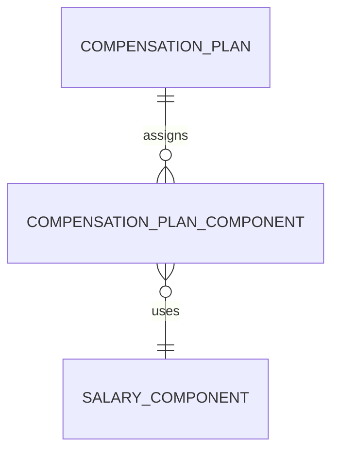

# Salary Component Relationships Explained

A focused guide to why `SalaryComponent` and `CompensationPlanComponent` are two entities, and how they work together.

This is a companion to [`ARCHITECTURE.md`](./ARCHITECTURE.md), which calls the pair **Compensation Components** when it refers to them together (§2).

> **Synced to the current design.** Deductions were retired in v0.5, so this guide covers the **compensation side only**.

---

## 1. The core idea

`SalaryComponent` is just a **vocabulary word** — it has no money.



`SalaryComponent` only stores a **name + category**. It does **not** contain an amount:

```
SalaryComponent
----------------
id, name, category

1 | Basic Salary | earning
2 | Bonus        | earning
3 | Housing      | allowance
4 | PF           | contribution
```

The **amount** lives on the assignment that uses the word — `CompensationPlanComponent`:

```
CompensationPlanComponent
-------------------------
id, compensation_plan_id, salary_component_id, amount, frequency
```

---

## 2. Two entities, one concept

| Entity                      | What it adds          | Meaning                      |
| --------------------------- | --------------------- | ---------------------------- |
| `SalaryComponent`           | `name`, `category`    | "What is it called?"         |
| `CompensationPlanComponent` | `amount`, `frequency` | "How much do we pay for it?" |

- `SalaryComponent` = **the word** ("Basic Salary")
- `CompensationPlanComponent` = **the paycheck amount** for that word

> `CompensationPlanComponent` carries **no currency of its own**. Amounts are always expressed in the owning contract's currency, because there is exactly one contract currency (§3, §5.6 of `ARCHITECTURE.md`).

---

## 3. Concrete example (India)

```
Monthly India Salary Plan
├─ Basic Salary        ₹70,000   ← CompensationPlanComponent
├─ Housing Allowance   ₹20,000   ← CompensationPlanComponent
└─ Bonus               ₹10,000   ← CompensationPlanComponent
```

The plan pays three components. An employee whose contract assigns this plan has a reported compensation of **₹100,000** — the sum of the `earning` and `allowance` amounts (§6.2 of `ARCHITECTURE.md`).

The same plan can be assigned to any number of contracts. Each contract supplies the currency the amounts are expressed in.

---

## 4. Why not put the amount on `SalaryComponent`?

Because the word is reusable and the amount is not:

- A **reusable definition** lets one "Basic Salary" word be used by an India plan and a Germany plan, at different amounts, without duplicating the definition.
- Because amounts settle in the **contract currency**, two contracts can pay the same component in different currencies. Putting `amount` (or `currency`) on the definition would force one amount and one currency on every user of that word.

Splitting them means a plan change (an amount) never touches the shared vocabulary, and adding a country never duplicates it.

---

## 5. Relationship diagram



---

## 6. TL;DR

| Entity                      | Question it answers          |
| --------------------------- | ---------------------------- |
| `SalaryComponent`           | "What is it called?"         |
| `CompensationPlanComponent` | "How much do we pay for it?" |

`SalaryComponent` is the shared vocabulary; `CompensationPlanComponent` is where the money is. Together they are the **Compensation Components** node of the domain overview.

The **deduct side no longer exists** — v0.5 retired `DeductionPlan`, `DeductionRule`, and `DeductionRuleBasis`. If you need the older, two-sided explanation, it is preserved at [`archive/SALARY-COMPONENT-RELATIONSHIPS-v0.4.md`](./archive/SALARY-COMPONENT-RELATIONSHIPS-v0.4.md).
