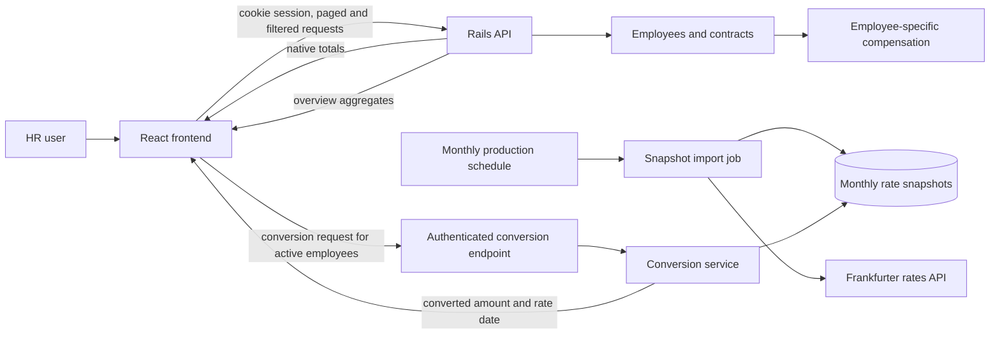
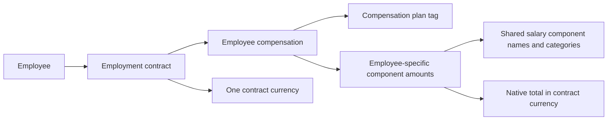
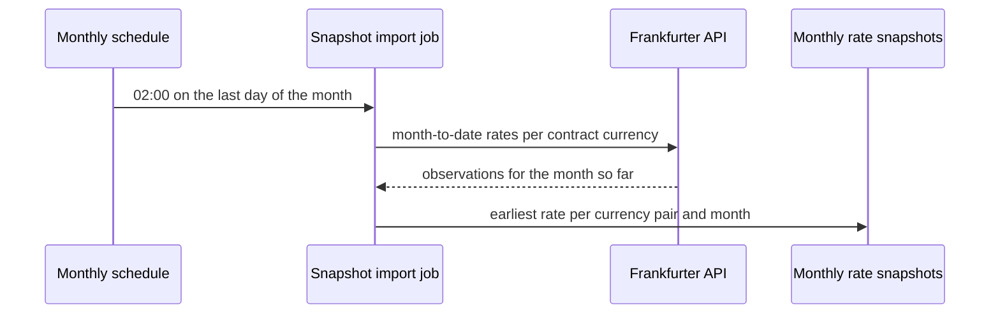
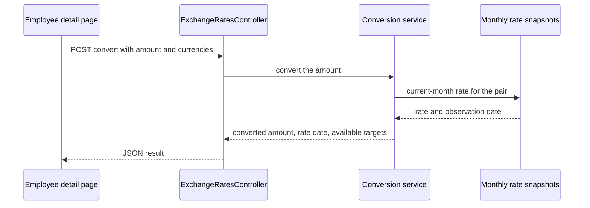

# Salary Manager Workflow and Overview

This guide is for developers joining the project or changing the employee compensation, dashboard roster, filters, and overview, and currency-conversion flows. It describes current behavior first, including the FX display on employee details. For entity details, see the [architecture](./ARCHITECTURE.md); for implementation phases, see the [implementation plan](./IMPLEMENTATION-PLAN.md).

## System at a glance

The React frontend uses the authenticated Rails API. Employee compensation stays in the currency of its contract. A separate backend process imports monthly exchange rates, and an authenticated API converts an amount from a stored snapshot when a client asks for it.

## Employee and compensation workflow

1. A user signs in through Rodauth. Successful sign-in sets the cookie session used for authenticated application requests.
2. The dashboard requests a page from `GET /api/v1/employees`. It lists active and inactive employees. Active contract location, start date, status, total, and total currency come from the contract whose dates include today. Inactive employees remain in the roster with no current contract details or total. The five filter controls narrow the roster on the server - name substring, department, designation, employment status, and contract country - so the page and its count reflect the filtered set, and changing one returns to the first page. A separate organization-wide `GET /api/v1/dashboard/summary` request powers the headline overview: it is not narrowed by the filters and reports the active-employee count plus, per contract country, the active headcount and the compensation total in that country's currency. The dashboard renders it as two sideways-scrolling strips of country cards - one for compensation, one for headcount - with the organization-wide active-employee total on the headcount strip's badge.
3. Selecting an employee opens its detail page. The frontend reads the employee, contract history, and country reference data. It selects the active contract for an active employee, or the most recently ended contract for an inactive employee.
4. Contract compensation components belong to that contract's `EmployeeCompensation`. Each row holds an amount and references shared salary-component vocabulary; the plan is a classification tag. The native total sums all component categories in the contract currency.
5. For an active employee with a total, the detail page requests conversion for the contract currency to learn which targets the current month supports. Choosing a target shows the converted total and the rate's observation date; the native total stays visible, and a missing rate or failed request is explained rather than hidden. Inactive employees never request conversion.

The contract country can have a default currency, but a contract may override it. Amounts and native totals use the contract's currency. The total is a direct sum, not payroll, net pay, or tax calculation. Contracts and compensation are currently read-only over HTTP; nested component assignment is supported by the model but has no contract write endpoint.

## FX rate import and conversion workflow

The production recurring schedule runs `FetchExchangeRateSnapshotsJob` at 02:00 on the last day of each month. For the run date, the job collects currencies from contracts active that day and uses them as base currencies. For each base, it asks Frankfurter for observations from the first of the month through the run date, then validates and groups the returned rows. It persists the earliest available observation for each quote currency and month.

`period_month` is the calendar month's first date and selects which snapshot the conversion service reads. `rate_date` is the provider observation date within that month. The unique pair/month index prevents a later scheduled run or retry from replacing an existing row. The job fetches all base-currency responses before writing and persists the rows in a transaction.

### Monthly rate import

### Amount conversion

Clients use authenticated `POST /api/v1/exchange_rates/convert` with `amount`, `from_currency`, and `to_currency`. The API validates a finite non-negative amount and three-letter currency codes, normalizes currency codes to uppercase, and returns decimal strings. `available_target_currencies` contains currencies with current-month snapshots for the requested base, plus the base currency itself.

- If source and target currencies match, the service returns the same amount with rate `1`; no observation date is needed.
- If the pair has no snapshot this month, `converted_amount`, `rate`, and `rate_date` are null.
- The endpoint does not make a live provider request and does not use a previous month's rate.
- `rate_date` on a successful cross-currency conversion identifies the provider observation used.

The employee detail page calls this endpoint for active employees only. It keeps the native total visible, defaults the target to the contract currency, and offers only targets returned by the API. A conversion shows the rate date; a missing rate or failed request is explained without hiding the native amount. Inactive employees never request conversion.

## Where to make changes

| Change | Primary area |
| --- | --- |
| Employee list and status payload | `Api::V1::EmployeesController`, `EmployeeQuery`, and employee request specs |
| Dashboard overview aggregates | `Api::V1::DashboardController` and `DashboardSummaryQuery` on the backend; `frontend/src/pages/Home.jsx` and its tests for the count, card, and chart |
| Dashboard filter controls | `frontend/src/pages/Home.jsx` and its colocated tests |
| Contract compensation response | `EmploymentContractsController` and `EmploymentContractCompensationService` |
| Snapshot data rules | `ExchangeRateSnapshot` model, migration, and model specs |
| Provider transport | `FrankfurterClient` and service specs |
| Monthly import behavior and schedule | `FetchExchangeRateSnapshotsJob`, job specs, and `config/recurring.yml` |
| Conversion request and response | `ExchangeRatesController`, `ExchangeRateConversionService`, request/service specs, and `backend/doc/openapi.yml` |
| Employee detail UI and FX display | `frontend/src/pages/EmployeeDetails.jsx` and colocated tests |

The complete route and schema reference is [backend/doc/openapi.yml](../backend/doc/openapi.yml). FX decisions by phase are in [ADR-0003](./decisions/ADR-0003-monthly-fx-snapshots-and-conversion.md), and the deployed topology is in [DEPLOYMENT.md](./DEPLOYMENT.md). Payroll, stored historical reporting, and contract write endpoints are not implemented; the dashboard overview is a current-state aggregate.
