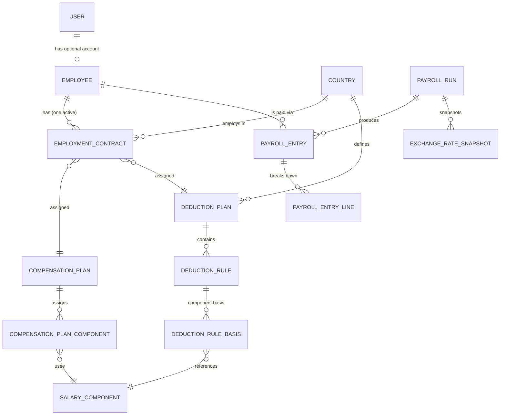

# Payroll Design v0.4 (superseded)

> **RETIRED — non-normative.** Superseded by [`../ARCHITECTURE.md`](../ARCHITECTURE.md) (v0.5), which retires the payroll-run and deduction model. Kept as the record of that model. Relative links below refer to the v0.4 document layout and may not resolve.

This document supersedes the v0.3 design — recorded, together with every earlier version, in [`archive/ARCHITECTURE-HISTORY.md`](./archive/ARCHITECTURE-HISTORY.md). It resolves every finding raised in the architectural review (2026-09-23), the four open questions v0.3 left behind, and the known issues raised since, while preserving the v0.1–v0.3 domain model, examples, and the core "shared vocabulary" design.

> The review findings and their resolutions — including the v0.3 → v0.4 resolutions — are tracked in [`RESOLUTION-LOG.md`](./RESOLUTION-LOG.md).

---

## 1. Design Principles & Explicit Assumptions

1. **The Employment Contract is the source of truth** for how an employee is paid (compensation + deductions).
2. **One active employment contract per employee** — enforced by `end_date` + a partial unique index.
3. **One payroll currency per contract.** Payroll is calculated in the contract currency. Component amounts carry no currency of their own. No FX during calculation.
4. **FX belongs to reporting only** — conversion is applied when producing normalized reports, never to payroll results.
5. **Auditability is explicit** — entries are persisted per run with a line-item breakdown that records both the resulting amount **and how it was derived** (basis + rate), and FX rates are snapshotted per run with source + rate date.
6. **Salary components are reusable across countries** (shared vocabulary).
7. **Deduction rules are country-specific** and evaluated in a defined order.
8. **Rounding** uses the currency's ISO 4217 minor unit (never a hardcoded 2 dp).
9. **Pay frequency is monthly** for v0.4 (contract field present, enum constrained to `monthly`).
10. **A payroll run processes all employees** with an active contract during the run period.

---

## 2. Domain Overview

### 2.1 Setup — pay & deduct structure

```
User
 |
Employee
 |
Employment Contract  (one payroll currency)
 |
 +----------------------+
 |                      |
 v                      v
Compensation Plan    Deduction Plan
 |                      |
 v                      v
CompensationPlanComponent  DeductionRule  (calculation_type, basis_type, sequence)
 |                      |
 v                      v
Salary Component <-- DeductionRuleBasis   (basis_type = component)
```

### 2.2 Execution & reporting

```
Payroll Run
 |
 v
Payroll Entry ──┬── PayrollEntryLine (breakdown)
 |
 v
Reporting Dashboard  (native view, then optional FX)
```

---

## 3. Currency Rule (resolves findings #2, #7)

- `EmploymentContract.currency` is the **single payroll currency** for the employee.
- It **defaults to** the employment `country`'s currency, and **may be overridden** (e.g. an expat in India paid in USD simply has `currency = USD`; the contract country remains India for deductions/reporting).
- `CompensationPlanComponent` and `DeductionRule.fixed` amounts are **always expressed in the contract currency** — no per-component currency field exists.
- Consequence: gross, deductions, and net are always computed in one currency; the "foreign-currency salary" use case from v0.1 is satisfied by contract-currency override, not by per-component FX.

---

## 4. Relationships



> **Persisted vs. transient:** all edges above are persisted foreign keys **except** the run-time read — `PayrollRun` reads each employee's active `EmploymentContract` at calculation time. That read is transient and intentionally **not** a persisted FK (the entry freezes the outcome; the contract remains mutable over time).

Textual summary:

- **User → Employee** (optional, one-to-one)
- **Country → Employment Contract / Deduction Plan** (one-to-many)
- **Employee → Employment Contract** (one-to-many over time; **one active**)
- **Employment Contract → Compensation Plan / Deduction Plan** (many-to-one)
- **Compensation Plan → Compensation Plan Component** (one-to-many)
- **Compensation Plan Component → Salary Component** (many-to-one)
- **Deduction Plan → Deduction Rule** (one-to-many)
- **Deduction Rule → Deduction Rule Basis** (one-to-many, only when `basis_type = component`)
- **Deduction Rule Basis → Salary Component** (many-to-one reference)
- **Payroll Run → Payroll Entry** (one-to-many)
- **Payroll Entry → Payroll Entry Line** (one-to-many)
- **Employee → Payroll Entry** (one-to-many)
- **Payroll Run → Exchange Rate Snapshot** (one-to-many)

---

## 5. Entity Definitions

### 5.1 User

```
User
----
id            bigint PK
name          string
email         string (unique)
role          enum: hr | manager | employee
```

An employee **may** have a user account (a user is not necessarily an employee).

### 5.2 Employee

```
Employee
--------
id            bigint PK
user_id       bigint FK → users, nullable, unique
name          string
```

> `country` is removed. Employment country lives on the active `EmploymentContract`; an employee's location is derived from it. Termination is represented by setting the contract's `end_date`.

### 5.3 Employment Contract (source of truth)

```
EmploymentContract
------------------
id                    bigint PK
employee_id           bigint FK → employees, not null
country_code          string FK → countries, not null
currency              char(3), not null       # payroll currency; defaults to country.currency, overridable
pay_frequency         enum: monthly            # constrained to monthly in v0.4
compensation_plan_id  bigint FK → compensation_plans
deduction_plan_id     bigint FK → deduction_plans
start_date            date, not null
end_date              date, nullable           # null = open-ended
```

Constraints:

- `CHECK (end_date IS NULL OR end_date > start_date)`
- Partial unique index: `UNIQUE (employee_id) WHERE end_date IS NULL` — at most one open-ended contract per employee.
- Application-level check: contract date ranges for an employee must not overlap.

### 5.4 Country (seeded reference)

```
Country
-------
code         char(2) PK  # ISO 3166-1 alpha-2
name         string
currency     char(3)     # ISO 4217
minor_unit   integer     # ISO 4217 exponent (0..4)
```

### 5.5 Compensation Plan

```
CompensationPlan
----------------
id            bigint PK
name          string
```

Contains one or more `CompensationPlanComponent`s.

### 5.6 Compensation Plan Component (assignment)

```
CompensationPlanComponent
-------------------------
id                    bigint PK
compensation_plan_id  bigint FK → compensation_plans
salary_component_id   bigint FK → salary_components
amount                decimal(16,4)   # in contract currency
frequency             enum: monthly    # constrained to monthly in v0.4
```

> `currency` is removed — the amount is always in the owning contract's payroll currency.

### 5.7 Salary Component (shared vocabulary)

```
SalaryComponent
---------------
id            bigint PK
name          string
category      enum: earning | allowance | contribution
```

- `earning` and `allowance` categories count toward **gross**.
- `contribution` (e.g. employer-side PF) is **not** part of gross; it is deferred (§10).

### 5.8 Deduction Rule

```
DeductionRule
-------------
id                 bigint PK
deduction_plan_id  bigint FK → deduction_plans   # the owning plan (§5.14)
name               string
calculation_type   enum: fixed | percentage
basis_type         enum: gross | component
fixed_amount       decimal(16,4), nullable   # required when calculation_type = fixed; in the contract currency
rate               decimal(16,6), nullable   # required when calculation_type = percentage; percent value (12.0 = 12%)
sequence           integer                   # evaluation order within the plan
```

Rules are evaluated in ascending `sequence` order (finding #4).

`fixed_amount` and `rate` are **separate columns** (resolved in v0.4). A single overloaded `rate` column could hold either a currency amount or a percent value, distinguished only by `calculation_type`, so a row could not be interpreted without reading a sibling column — and the two quantities would share one scale. Keeping them apart puts the unit in the column name.

Constraints:

- Exactly one of `fixed_amount` / `rate` is non-null, and it must match `calculation_type`: `fixed` ⇒ `fixed_amount` set and `rate` null; `percentage` ⇒ `rate` set and `fixed_amount` null.
- `basis_type = component` ⇒ the rule must have ≥ 1 `DeductionRuleBasis`.
- `basis_type = gross` ⇒ the rule must have 0 `DeductionRuleBasis`.
- `calculation_type = fixed` ⇒ `basis_type` is ignored (no basis).

### 5.9 Deduction Rule Basis

```
DeductionRuleBasis
------------------
id                 bigint PK
deduction_rule_id  bigint FK → deduction_rules
salary_component_id bigint FK → salary_components   # only present when basis_type = component
weight             decimal(6,4), default 1.0        # fraction of that component included in the basis
```

Supports compound bases (e.g. "10% of Basic + 5% of Housing") by summing weighted component amounts.

### 5.10 Payroll Run

```
PayrollRun
-----------
id                 bigint PK
period_start       date, not null
period_end         date, not null
status             enum: draft | calculated | approved | paid
supersedes_run_id  bigint FK → payroll_runs, nullable, unique   # the run this one replaces
```

- Pay frequency is **monthly**: `period_start`/`period_end` span a calendar month.
- Status workflow: `DRAFT → CALCULATED → APPROVED → PAID`. `APPROVED`/`PAID` are placeholders; the approval and payment workflows are deferred (§10).
- `supersedes_run_id` records a re-run's relationship to the run it replaces (resolved in v0.4; see §8). The `unique` constraint means any run can be superseded by **at most one** later run, so supersession chains are linear and cannot branch.

### 5.11 Payroll Entry

```
PayrollEntry
-------------
id                     bigint PK
payroll_run_id         bigint FK → payroll_runs
employee_id            bigint FK → employees
employment_contract_id bigint          # frozen: the contract this entry was calculated from
compensation_plan_id   bigint          # frozen: plan in force at run time
deduction_plan_id      bigint          # frozen: plan in force at run time
gross_amount           decimal(16,4)
deduction_amount       decimal(16,4)
net_amount             decimal(16,4)
currency               char(3), not null  # frozen copy of the contract currency at run time
```

- `employment_contract_id`, `compensation_plan_id` and `deduction_plan_id` are **frozen values, not foreign keys**. Because the run's contract read is transient (§4), these columns are what record _which_ contract and plans produced the entry. They are deliberately not FK constraints: the referenced rows remain mutable and may be corrected or retired, and that must not retroactively alter a past run.
- `PayrollResult` (v0.2) is **not** persisted; the native reporting view is a `GROUP BY currency` over `PayrollEntry`.

### 5.12 Payroll Entry Line (breakdown — resolves finding #5)

```
PayrollEntryLine
----------------
id                  bigint PK
payroll_entry_id    bigint FK → payroll_entries
line_type           enum: earning | deduction
label               string            # denormalized component/rule name as of the run
amount              decimal(16,4)
basis_amount        decimal(16,4), nullable   # the amount the rate was applied to
rate                decimal(16,6), nullable   # the rate that was applied
basis_type          enum: gross | component, nullable
salary_component_id bigint FK → salary_components, nullable
deduction_rule_id   bigint FK → deduction_rules, nullable
sequence            integer
```

Every `PayrollEntry` is accompanied by its full line-item breakdown, frozen at run time.

- `amount` answers _"what was this line worth?"_; `basis_amount`, `rate` and `basis_type` answer _"how was it derived?"_. Storing the inputs makes a historical figure **reproducible** (`basis_amount × rate / 100 = amount`) rather than merely labelled — the same guarantee that `ExchangeRateSnapshot` already provides for FX.
- Earning lines leave `basis_amount`, `rate` and `basis_type` null: they are inputs, not calculations.
- `label` is a snapshot of the component/rule name so the line stays readable after the source row is renamed or deleted.

### 5.13 Exchange Rate Snapshot (resolves finding #9)

```
ExchangeRateSnapshot
--------------------
id              bigint PK
payroll_run_id  bigint FK → payroll_runs
from_currency   char(3)
to_currency     char(3)
rate            decimal(16,10)
rate_date       date       # as-of date of the rate
source          string     # e.g. "ECB", "openexchangerates", "manual"
```

### 5.14 Deduction Plan

```
DeductionPlan
-------------
id            bigint PK
country_code  string FK → countries, not null
name          string
```

- A plan belongs to exactly one country and is that country's catalogue of deductions (§1.7). This is the `COUNTRY → DEDUCTION_PLAN` **"defines"** edge in §4.
- A contract selects exactly one plan → `EmploymentContract.deduction_plan_id` (§5.3), the **"assigned"** edge.
- A plan owns its rules → `DeductionRule` (§5.8), the **"contains"** edge.
- The plan itself carries no amounts; all behaviour lives on its rules and their bases.

> Appended as §5.14 rather than inserted after §5.4 so that the existing §5.x numbering stays stable — that numbering is referenced by `RESOLUTION-LOG.md` and by both companion docs.

---

## 6. Payroll Calculation Engine

### 6.1 Inputs

For a given employee, read the **active contract** (§7) and resolve:

- `compensation_plan_id` → `CompensationPlanComponent`s → `SalaryComponent`s
- `deduction_plan_id` → `DeductionRule`s (ordered by `sequence`) → optional `DeductionRuleBasis`s

### 6.2 Gross

```
gross = Σ component.amount
        for components whose category ∈ { earning, allowance }
```

All amounts are in the contract currency. No FX.

### 6.3 Deductions

For each rule in ascending `sequence` order:

```
basis(rule) =
  case rule.basis_type
  when gross      then gross
  when component  then Σ over rule.bases: component_amount(component) * weight
  end

amount(rule) =
  case rule.calculation_type
  when fixed      then rule.fixed_amount
  when percentage then basis(rule) * rule.rate / 100
  end
```

- A rule computed on a component uses **that component's amount as included in gross** (not a previous deduction's output). Rules referencing another deduction's result are **not supported** (deferred, §10).
- `component_amount(x)` is defined for every category that contributes to gross — `earning` and `allowance`. A `component` basis may therefore reference an **allowance** (resolved in v0.4; e.g. a deduction assessed on gross wages including Housing Allowance). A `contribution` component is **not** valid in a basis: it is excluded from gross (§5.7) and has no `component_amount`. The engine rejects such a rule as a configuration error.
- `rate` is used at its full stored precision (`decimal(16,6)`). It is never rounded before multiplication; only the resulting line amount is rounded (§6.4). `fixed_amount` is already a currency amount at money scale, so it is used as stored.
- If total deductions exceed gross, the engine **rejects that employee's line** with a validation error (negative net is treated as a configuration problem).

### 6.4 Rounding (resolves finding #14)

- Each computed line amount is rounded **half-up** to the contract currency's `minor_unit` (ISO 4217 exponent) at computation time.
- Monetary columns are stored as `decimal(16,4)` (covers all ISO 4217 minor units ≤ 4).
- `net = gross − deductions`, where `gross` and `deductions` are the **sums of already-rounded lines**.

Rounding is therefore **per line, at computation time** — never end-of-run. Two consequences follow:

- There is no residual rounding difference to reconcile, because `net` is defined as the sum of the rounded lines rather than as `round(gross − deductions)`.
- `rate` is applied at full stored precision (`decimal(16,6)`) and is never pre-rounded, so an imprecise rate (e.g. `12.5`) affects only the line amount, which is then rounded exactly once.

> Per-line rounding is also what makes each stored `PayrollEntryLine` self-verifying: `round(basis_amount × rate / 100)` reproduces `amount` exactly (§5.12).

### 6.5 Worked example (Rahul, India — INR)

Plan components (contract currency INR):

| Component         | Category  | Amount |
| ----------------- | --------- | ------ |
| Basic Salary      | earning   | 70,000 |
| Housing Allowance | allowance | 20,000 |
| Bonus             | earning   | 10,000 |

**Gross = 100,000**

Deduction rules (ordered by `sequence`):

| seq | Rule           | calculation_type | basis_type               | basis   | rate / fixed_amount | amount |
| --- | -------------- | ---------------- | ------------------------ | ------- | ------------------- | ------ |
| 1   | Provident Fund | percentage       | component → Basic Salary | 70,000  | 12%                 | 8,400  |
| 2   | Income Tax     | percentage       | gross                    | 100,000 | 10%                 | 10,000 |
| 3   | Insurance      | fixed            | —                        | —       | 500                 | 500    |

**Total deductions = 18,900 → Net = 81,100**

Result:

```
PayrollEntry:        gross=100,000  deduction=18,900  net=81,100  currency=INR
PayrollEntryLine:
  earning   Basic Salary        70,000
  earning   Housing Allowance   20,000
  earning   Bonus               10,000
  deduction Provident Fund       8,400
  deduction Income Tax          10,000
  deduction Insurance              500
```

---

## 7. Active Contract Resolution (resolves finding #6)

- A contract is **active on date D** iff `start_date <= D` and (`end_date IS NULL` or `D <= end_date`).
- **One active contract per employee** is enforced by the partial unique index (`UNIQUE (employee_id) WHERE end_date IS NULL`) plus an application-level non-overlap check on date ranges.
- For a payroll run over `[period_start, period_end]`, an employee is **in scope** iff their active contract covers the period: `start_date <= period_end` and (`end_date IS NULL` or `end_date >= period_start`).
- Termination = setting the contract `end_date`. Proration for mid-period hire/termination is deferred (§10).

---

## 8. Run Scope & Idempotency (resolves finding #10)

- A `PayrollRun` processes **all employees** with an active contract during the run period (§7).
- **Re-running a period creates a new `PayrollRun`**; prior runs and their entries/lines are preserved for audit. There is no in-place mutation of a run once it reaches `CALCULATED`.
- A run is identified by its period (start/end). Duplicate runs for the same period are permitted for auditability, and supersession removes the ambiguity between them: a re-run records the run it replaces in `PayrollRun.supersedes_run_id` (§5.10), forming a linear chain.
- **Reporting prefers the head of the chain** — the run for a period that no other run supersedes. Superseded runs stay fully queryable (that is the point of preserving them) but are excluded from default reporting and marked "superseded" when listed.

---

## 9. FX Handling (resolves finding #9)

FX is **outside** payroll calculation.

- **Payroll:** `Contract Currency → Gross → Deductions → Net`
- **Reporting:** `Payroll Entries → FX Conversion → Normalized Report`

Snapshot rules:

- **Reporting currencies are a configured list**, not something derived from payroll data. Each currency that reports are produced in is registered as a reporting currency; the set is system configuration, not a property of any country or contract.
- At run time, an `ExchangeRateSnapshot` is stored per `PayrollRun` for **every combination of an entry currency present in that run × a configured reporting currency**, with `rate`, `rate_date`, and `source`. A run therefore writes `distinct entry currencies × configured reporting currencies` rows, and never snapshots a pair no entry needs.
- Because the snapshot set is fixed when a run executes, **registering a new reporting currency later does not alter past runs' snapshots** (resolved in v0.4). A report in that new currency over an older run finds the pair missing and falls back to the estimated path below — the intended behaviour, not a defect in the run.
- **Snapshots are never shared between runs.** A run owns its snapshots, and a re-run of the same period takes fresh ones. A run's FX basis is consequently self-contained, which is what allows an audited report to be produced without first deciding which of several runs for a period is authoritative. Carrying a rate forward from an earlier run is permitted, but only as an explicit, recorded act: `source` records the origin (e.g. `"carried forward from run 900"`), so a deliberate carry-forward can never be mistaken for a freshly sourced rate.
- **Audited report:** uses only snapshots belonging to the same run. A run whose snapshots are incomplete is marked "estimated" in normalized reporting.
- **Estimated report:** if a pair is missing, reporting falls back to the most recent snapshot (or a live fetch), and the report is explicitly labeled **not audited**.

Example — Payroll Run: September 2026:

| from | to  | rate   | rate_date  | source |
| ---- | --- | ------ | ---------- | ------ |
| INR  | USD | 0.0115 | 2026-09-30 | ECB    |
| EUR  | USD | 1.08   | 2026-09-30 | ECB    |

---

## 10. Deferred Items

- Payroll approvals (beyond the placeholder `status` values)
- Payment processing
- Country-specific tax engines
- `contribution` category components (employer-side)
- Deductions computed on other deductions' outputs
- Proration for mid-period hire/termination
- Pay frequencies other than `monthly`

---

## 11. Open Questions

**None.** Every question raised in v0.3 and every known issue raised since is resolved. Decisions and rationale are in [`RESOLUTION-LOG.md`](./RESOLUTION-LOG.md).

Resolved in v0.4 — v0.3 open questions:

| v0.3 question                                | Resolution                                                                                      | Where        |
| -------------------------------------------- | ----------------------------------------------------------------------------------------------- | ------------ |
| Allowance components in a `component` basis? | Allowed for every gross-contributing category (`earning`, `allowance`); `contribution` rejected | §6.3         |
| Per-line or end-of-run rounding?             | Per-line, at computation time                                                                   | §6.4         |
| Do duplicate runs reuse FX snapshots?        | Never shared; fresh per run, carry-forward must be recorded in `source`                         | §9           |
| Freeze the contract snapshot on entries?     | Yes — contract + plan ids on `PayrollEntry`, basis + rate on `PayrollEntryLine`                 | §5.11, §5.12 |

Resolved in v0.4 — known issues:

| Issue                                                   | Resolution                                                                              | Where                                                                              |
| ------------------------------------------------------- | --------------------------------------------------------------------------------------- | ---------------------------------------------------------------------------------- |
| `DeductionRule.rate` held either an amount or a percent | Split into `fixed_amount` and `rate`; exactly one is set, matching `calculation_type`   | §5.8                                                                               |
| "Each reporting currency in use" undefined              | A configured list; a run snapshots (entry currencies × configured reporting currencies) | §9                                                                                 |
| "Flagged in reporting" had no mechanism                 | `PayrollRun.supersedes_run_id`; reporting prefers the chain head                        | §5.10, §8                                                                          |
| `DeductionPlan` had no definition block                 | Defined with `id` / `country_code` / `name`                                             | §5.14                                                                              |
| v0.1/v0.2 India illustration did not reconcile          | Documented as a self-contained round-number illustration                                | [`archive/ARCHITECTURE-ILLUSTRATIONS.md`](./archive/ARCHITECTURE-ILLUSTRATIONS.md) |

Work deliberately left out of scope is listed in §10 (Deferred Items) rather than here.

---

## 12. Data Flow Summary

```
HR Setup:
  User → Employee → EmploymentContract
      ├─ CompensationPlan → CompensationPlanComponent → SalaryComponent
      └─ DeductionPlan → DeductionRule ─(component basis)─ DeductionRuleBasis → SalaryComponent

Run:
  PayrollRun → active EmploymentContract (transient read)
      → Gross (Σ earning/allowance components, contract currency)
      → Deductions (rules in sequence order, per basis_type)
      → PayrollEntry (+ frozen contract + plan ids) + PayrollEntryLine (+ basis + rate)

Reporting:
  PayrollEntry (GROUP BY currency) → native view
  PayrollEntry + ExchangeRateSnapshot → normalized view
```
