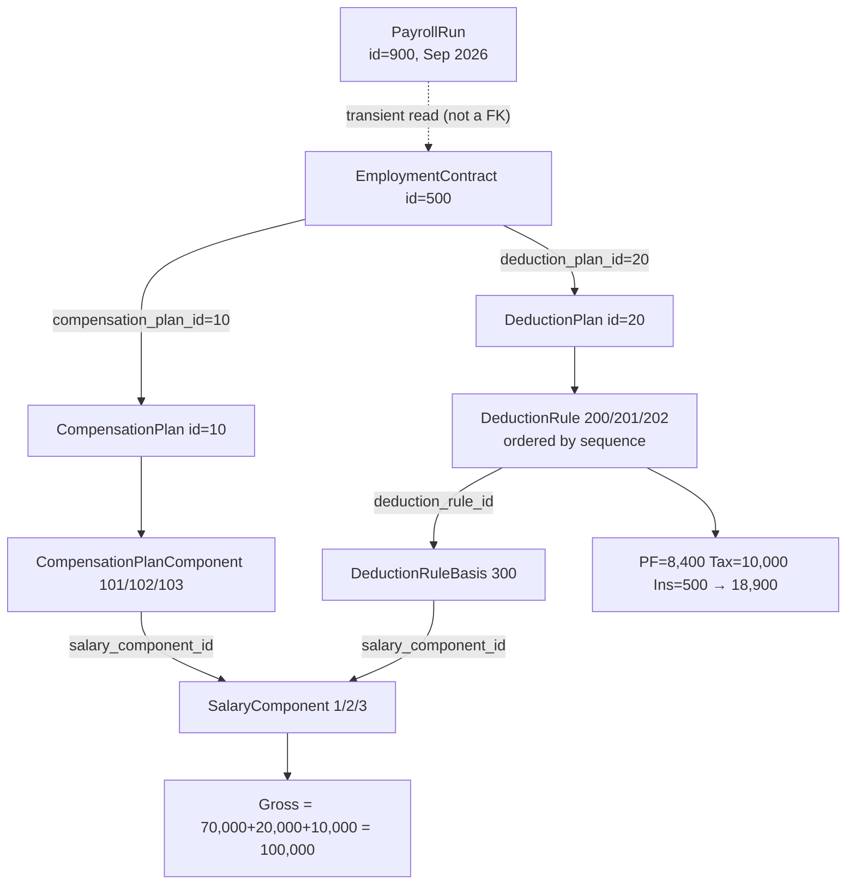

# Data Flow — End-to-End Walkthrough (v0.4)

> **RETIRED — non-normative.** The v0.4 payroll-run walkthrough. v0.5 retires payroll runs and deductions, so this no longer matches `ARCHITECTURE.md`. Kept as the record of the retired model. Relative links below refer to the v0.4 layout and may not resolve.

How data passes through the payroll system, with concrete record IDs and foreign keys.

This is a companion to [`ARCHITECTURE.md`](./ARCHITECTURE.md) and [`SALARY-COMPONENT-RELATIONSHIPS.md`](./SALARY-COMPONENT-RELATIONSHIPS.md).

> **Synced to the retired v0.4 design.** Entity names, enums, and worked figures below match the archived `ARCHITECTURE-v0.4.md`.

---

## Phase 1 — Setup: HR creates the records

### Reference data (created once)

```
Country:           code=IN, name=India, currency=INR, minor_unit=2

SalaryComponent (definitions — no money):
  1 | Basic Salary      | earning
  2 | Housing Allowance | allowance
  3 | Bonus             | earning
```

### Pay structure (created once, reused by many)

```
CompensationPlan:   id=10, name="Monthly India Salary Plan"

CompensationPlanComponent (line items):
  101 | plan=10 | component=1 (Basic)   | amount=70,000 | monthly
  102 | plan=10 | component=2 (Housing) | amount=20,000 | monthly
  103 | plan=10 | component=3 (Bonus)   | amount=10,000 | monthly
```

> No `currency` column: every component amount is expressed in the **contract's payroll currency** (§3, finding #2).

### Deduction structure (created once per country)

```
DeductionPlan:      id=20, country_code=IN, name="India Payroll Plan"

DeductionRule:
  200 | plan=20 | Provident Fund | percentage | component | rate=12          | seq=1
  201 | plan=20 | Income Tax     | percentage | gross     | rate=10          | seq=2
  202 | plan=20 | Insurance      | fixed      | —         | fixed_amount=500 | seq=3

DeductionRuleBasis (which component a rule applies to — only for basis_type=component):
  300 | rule=200 (PF) | component=1 (Basic Salary) | weight=1.0
  --  | rule=201 (Tax)       | basis_type=gross ⇒ no basis rows
  --  | rule=202 (Insurance) | calculation_type=fixed ⇒ basis ignored
```

### Employee & contract (per person)

```
User:               id=1, name="Rahul Sharma", role=Employee

Employee:           id=100, user_id=1, name="Rahul Sharma"

EmploymentContract: id=500, employee_id=100, country_code=IN, currency=INR,
                    pay_frequency=monthly,
                    compensation_plan_id=10,   ← points at the pay package
                    deduction_plan_id=20,      ← points at the deduction package
                    start_date=2025-01-01,
                    end_date=null              ← null = open-ended (one active per employee)
```

> The contract is the **hub**. It holds just two FKs (`compensation_plan_id`, `deduction_plan_id`). Everything else is fetched by following those.
>
> `Employee.country` is gone (§5.2, finding #7): employment country lives here, on the contract, so an employee's location is derived from their active contract rather than duplicated on the person.

---

## Phase 2 — Payroll Run: how data flows at calculation time



### Step-by-step traversal

1. **Create the run** → `PayrollRun(id=900, period_start=2026-09-01, period_end=2026-09-30, status=DRAFT)`. A re-run of the same period would create a second row and set its `supersedes_run_id=900`; that is what lets reporting pick a single authoritative run for the period instead of guessing (§8).

2. **Read the active contract** for employee 100 → `EmploymentContract(500)`.
   - It says: currency **INR**, pay with **plan 10**, deduct with **plan 20**.
   - This read is **transient**, not a persisted foreign key. The run resolves the contract at calculation time; the entry it produces freezes the outcome instead, so a later contract edit cannot rewrite a past run (§4, finding #12).

3. **Compute gross** — follow `compensation_plan_id=10`:

   ```
   CompensationPlanComponent WHERE compensation_plan_id=10
      JOIN SalaryComponent ON salary_component_id
   →
   101 → Basic Salary    70,000
   102 → Housing         20,000
   103 → Bonus           10,000
   ---------------------------------
   Gross = 70,000 + 20,000 + 10,000 = ₹100,000
   ```

4. **Apply deductions** — follow `deduction_plan_id=20`, in ascending `sequence`:

   ```
   DeductionRule WHERE deduction_plan_id=20 ORDER BY sequence
      LEFT JOIN DeductionRuleBasis ON deduction_rule_id
         JOIN SalaryComponent ON salary_component_id
   →
   seq=1  PF (200):        basis_type=component → Basic Salary (1) → 12% × 70,000  = 8,400
   seq=2  Tax (201):       basis_type=gross                         → 10% × 100,000 = 10,000
   seq=3  Insurance (202): calculation_type=fixed — basis ignored   → 500
   -------------------------------------------------------------------------
   Deduction total = 8,400 + 10,000 + 500 = ₹18,900
   ```

   A rule's basis resolves from `basis_type`: `gross` uses the full gross, `component` sums the weighted amounts of its `DeductionRuleBasis` rows. A component basis may reference any component that counts toward gross — `earning` or `allowance` — but never a `contribution`, which is not part of gross. A `fixed` rule ignores its basis entirely and contributes its `fixed_amount` (§5.8, §6.3).

5. **Net** = 100,000 − 18,900 = **₹81,100**. Each line is rounded half-up to the currency's ISO 4217 minor unit at computation time — INR happens to be 2, but this is never hardcoded (§6.4, finding #14).

---

## Phase 3 — Write the results

```
PayrollEntry:
  id=1000 | run=900 | employee=100
  contract=500 | compensation_plan=10 | deduction_plan=20    ← frozen, not FKs
  gross=100,000 | deduction=18,900 | net=81,100 | currency=INR

PayrollEntryLine (the frozen breakdown that makes those totals explainable):
  # earnings are inputs, so basis/rate stay null
  seq=1 | earning   | Basic Salary      | 70,000 | component=1
  seq=2 | earning   | Housing Allowance | 20,000 | component=2
  seq=3 | earning   | Bonus             | 10,000 | component=3
  # deductions record how the amount was derived
  seq=1 | deduction | Provident Fund    |  8,400 | rule=200 | basis=70,000  | rate=12          | component
  seq=2 | deduction | Income Tax        | 10,000 | rule=201 | basis=100,000 | rate=10          | gross
  seq=3 | deduction | Insurance         |    500 | rule=202 | basis=—       | fixed_amount=500 | —
```

> The `PayrollEntry` row **freezes** the totals as of that run — even if the plan changes later, this run's history is preserved. `PayrollEntryLine` freezes the _composition_ alongside it, and now also the _derivation_ (`basis_amount`, `rate`, `basis_type`), so `70,000 × 12% = 8,400` is reproducible from the stored row alone rather than merely labelled (§5.12 — finding #5 and Q4).

---

## Phase 4 — Reporting

```
Native view (no FX):
  Group PayrollEntry by currency
  → INR: employees=1, gross=₹100,000, net=₹81,100

Normalized view (FX):
  ExchangeRateSnapshot: run=900, INR→USD, rate=0.0115,
                        rate_date=2026-09-30, source=ECB
  → ₹81,100 × 0.0115 = $932.65
```

> These snapshots belong to run 900 alone. A re-run of September takes fresh rates rather than reusing them; if a rate were deliberately carried forward, `source` would have to record that (§9).

---

## The data chain in one glance

```
PayrollRun
  ⋯> EmploymentContract              (transient read — resolved at run time, NOT a FK)
       ├─ compensation_plan_id → CompensationPlan → CompensationPlanComponent → SalaryComponent
       └─ deduction_plan_id    → DeductionPlan → DeductionRule → DeductionRuleBasis → SalaryComponent
            ↓ (results, persisted)
       PayrollEntry (+ frozen contract/plan ids) ── PayrollEntryLine (+ basis/rate)
            ↓ (reporting)
       ExchangeRateSnapshot
```

`SalaryComponent` is the single shared table that both the "pay" path and the "deduct" path join into, via two different join tables (`CompensationPlanComponent` and `DeductionRuleBasis`).
