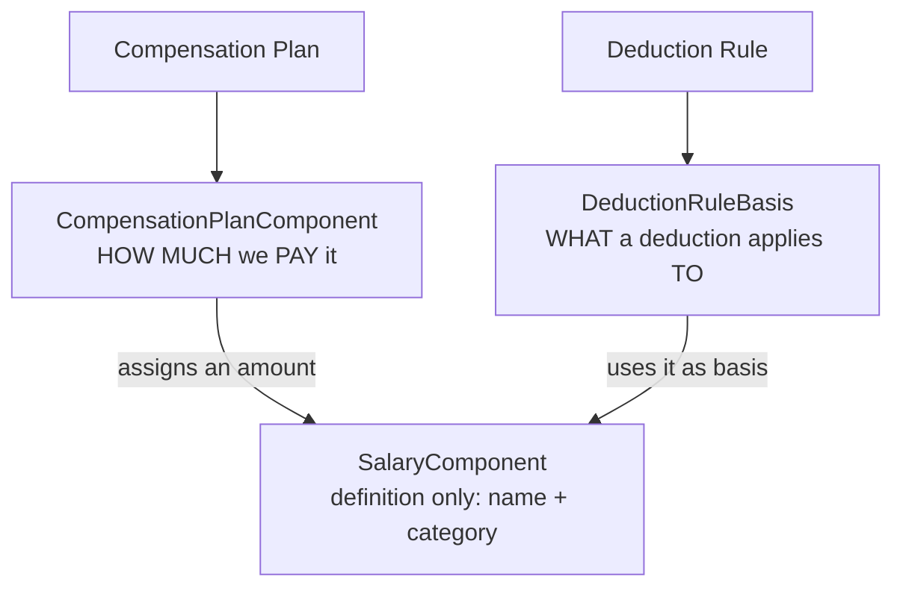
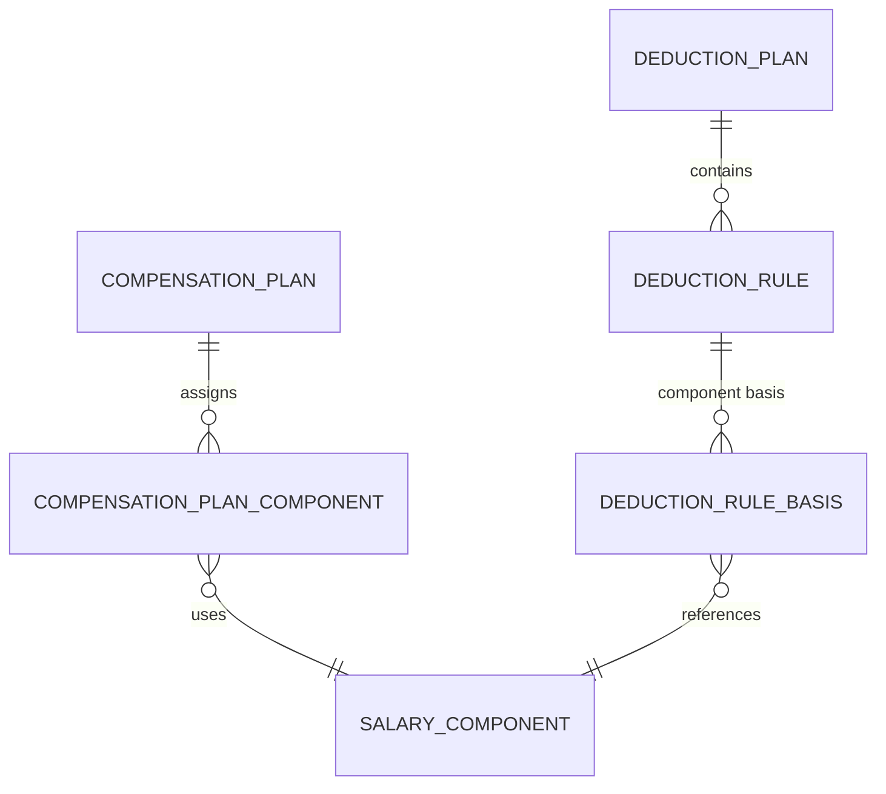

# Salary Component Relationships Explained (v0.4)

> **RETIRED — non-normative.** The two-sided (pay + deduct) version. Superseded by [`SALARY-COMPONENT-RELATIONSHIPS.md`](../SALARY-COMPONENT-RELATIONSHIPS.md), which covers the compensation side only. Relative links below may not resolve.

A focused guide to how `SalaryComponent`, `CompensationPlanComponent`, `DeductionRule`, and `DeductionRuleBasis` relate to each other.

This is a companion to [`ARCHITECTURE.md`](./ARCHITECTURE.md).

> **Synced to the current design.** The `basis_type`, `sequence`, and `weight` concepts below, and the rule that allowances are valid bases, all come from the architectural review. See `RESOLUTION-LOG.md`.

---

## 1. The core idea

`SalaryComponent` is just a **vocabulary word** — it has no money.



`SalaryComponent` only stores a **name + category**. It does **not** contain an amount:

```
SalaryComponent
----------------
id, name, category

1 | Basic Salary | earning
2 | Bonus        | earning
3 | Housing      | allowance
4 | PF           | contribution
```

---

## 2. Two different things point to it

| Side             | Entity                      | What it adds                                  | Meaning                                |
| ---------------- | --------------------------- | --------------------------------------------- | -------------------------------------- |
| **Compensation** | `CompensationPlanComponent` | `amount`, `frequency`                         | "We **pay** Basic Salary ₹70,000"      |
| **Deduction**    | `DeductionRuleBasis`        | `deduction_rule_id`, `weight` (default `1.0`) | "PF is **calculated on** Basic Salary" |

- `SalaryComponent` = **the word** ("Basic Salary")
- `CompensationPlanComponent` = **the paycheck amount** for that word
- `DeductionRuleBasis` = **the anchor** that says which word a deduction uses

> `CompensationPlanComponent` carries **no currency of its own**. Amounts are always expressed in the owning contract's payroll currency, because there is exactly one payroll currency per contract (§3, §5.6 — finding #2).

---

## 3. Concrete example (India)

### Compensation side — the plan pays three components

```
Monthly India Salary Plan
├─ Basic Salary        ₹70,000   ← CompensationPlanComponent
├─ Housing Allowance   ₹20,000   ← CompensationPlanComponent
└─ Bonus               ₹10,000   ← CompensationPlanComponent
```

### Deduction side — the rules pick a component to apply to

```
India Payroll Plan  (evaluated in ascending `sequence`)
├─ seq=1  PF rule: 12%   → basis_type=component → Basic Salary
│                          ← DeductionRuleBasis points to "Basic Salary"
├─ seq=2  Tax rule: 10%  → basis_type=gross     (no DeductionRuleBasis rows)
└─ seq=3  Insurance: ₹500 fixed  (basis ignored)
```

Each rule declares **what its percentage applies to** through `basis_type`:

- `basis_type = gross` — the basis is the whole gross. The rule has no basis rows.
- `basis_type = component` — the rule has one or more `DeductionRuleBasis` rows, each naming a `salary_component_id` and an optional `weight` (the fraction of that component included in the basis, default `1.0`).

Weighting is what allows compound bases such as "10% of Basic + 5% of Housing" without introducing a new rule type. Rules are evaluated in ascending `sequence` order.

A basis may reference any component that counts toward **gross** — `earning` or `allowance`. A `contribution` component cannot be a basis, because it is not part of gross (§6.3, Q1).

### When payroll runs

```
PF = 12% × Basic Salary (₹70,000) = ₹8,400
```

The **deduction does not care about the compensation plan**. It only says "apply 12% to whatever the amount for 'Basic Salary' is." That is why both sides point at the same `SalaryComponent` instead of at each other.

---

## 4. Why not connect Compensation Plan and Deduction Plan directly?

Because the two sides need different granularity:

- A **compensation plan** says _how much_ each component is worth.
- A **deduction rule** says _which_ component(s) to calculate on.

By sharing `SalaryComponent` as the common vocabulary, the **same** "Basic Salary" definition is reused by a salary plan in India and a deduction plan in Germany — without duplicating the definition, and without coupling the two plans together.

This is also why the "pay" side and the "deduct" side can be configured independently: neither needs to know the other's currency, because the contract supplies the single payroll currency they both settle in.

---

## 5. Relationship diagram



---

## 6. TL;DR

| Entity                      | Question it answers                        |
| --------------------------- | ------------------------------------------ |
| `SalaryComponent`           | "What is it called?"                       |
| `CompensationPlanComponent` | "How much do we pay for it?"               |
| `DeductionRule`             | "What deduction applies, on what basis?"   |
| `DeductionRuleBasis`        | "Which component does that deduction use?" |

`DeductionRule.basis_type` decides whether that last question is asked at all: a `gross` rule stops at `DeductionRule`, a `component` rule continues into `DeductionRuleBasis`.

`SalaryComponent` is the shared glue: **compensation pays it, deductions calculate on it.**
